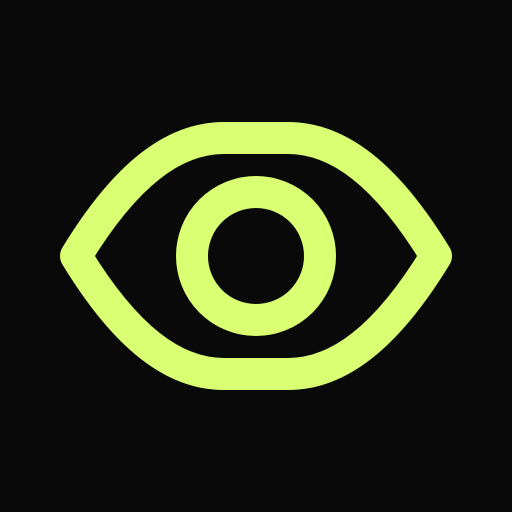
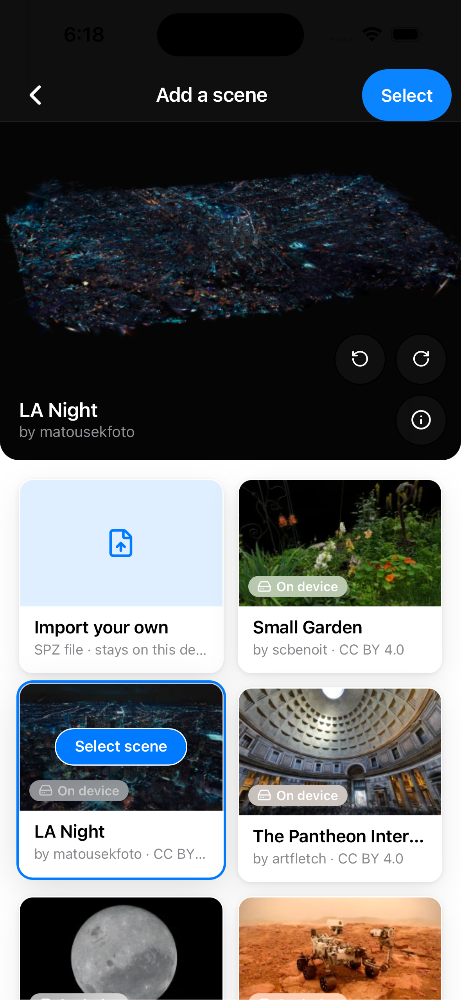
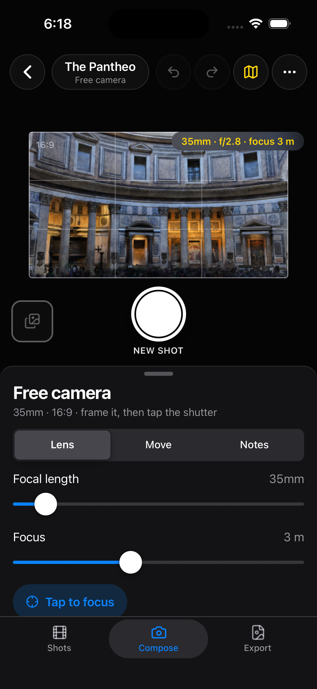
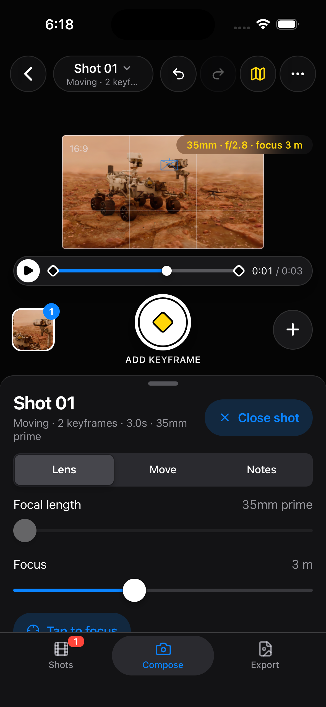
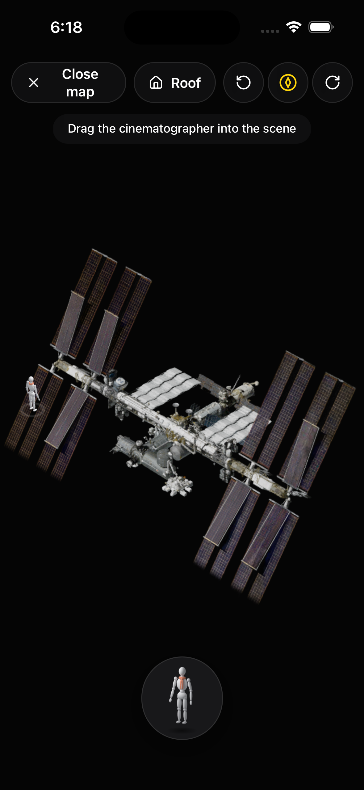
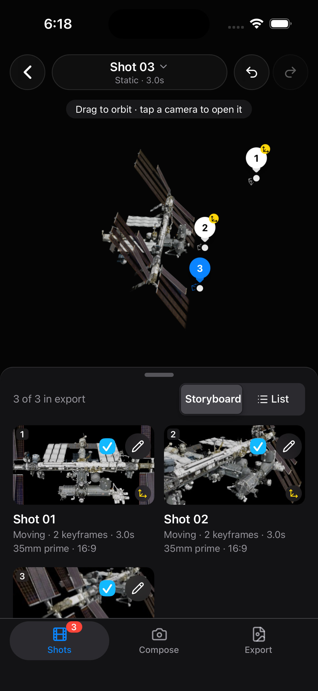
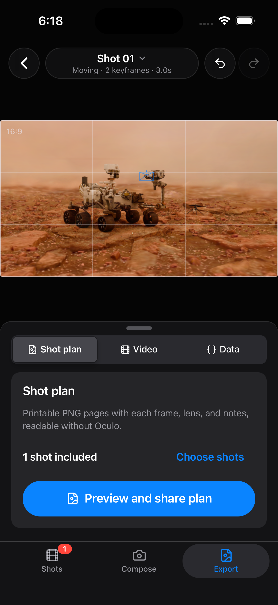
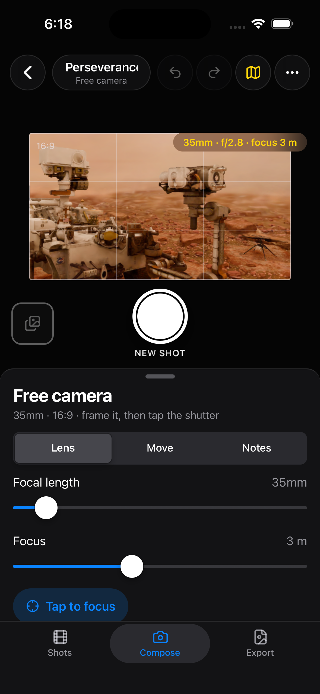
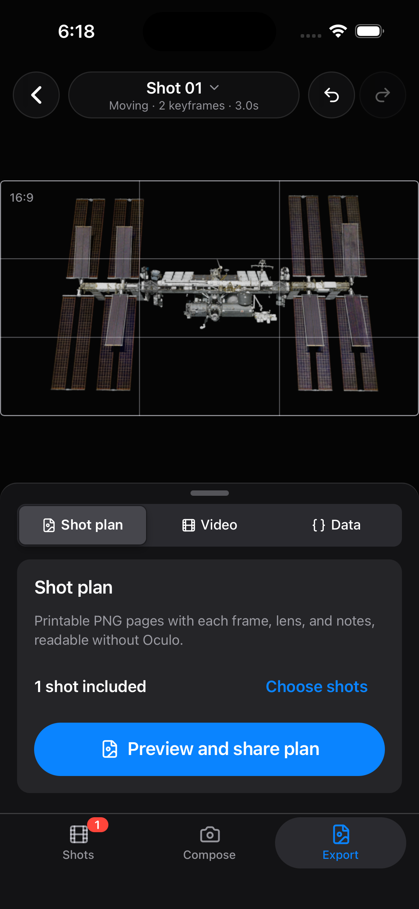

# Oculo



Oculo is an iPhone app for spatial cinematography, built with Capacitor, React and TypeScript. A filmmaker enters a photorealistic world, scouts it, composes shots with real camera and lens controls, saves them as static shots or moving shots built from keyframes, previews the result, and shares it.

The [Version 1.0 PRD](docs/PRD.md) defines an iPhone shot-planning app: durable SPZ import, saved shots, expanded movement editing, PNG shot sheets and supported MP4 previews. Free includes one saved project; the one-time Oculo Pro unlock adds projects. See [implementation alignment](docs/PRD_ALIGNMENT.md) for completed code and remaining device acceptance, and [architecture](docs/ARCHITECTURE.md).

Accounts and cloud sync are disabled unless you provide Firebase environment values, and purchases are disabled unless you provide RevenueCat configuration. Local importing, editing and exports work without either.

## Screenshots

Captured in the iOS Simulator.

<table>
  <tr>
    <td align="center"><br><sub>Pick a bundled scene or import your own <code>.spz</code></sub></td>
    <td align="center"><br><sub>Frame a shot with real lens controls</sub></td>
    <td align="center"><br><sub>Plan a camera move with keyframes</sub></td>
    <td align="center"><br><sub>Map view with the cinematographer figure</sub></td>
  </tr>
  <tr>
    <td align="center"><br><sub>Saved shots as a storyboard</sub></td>
    <td align="center"><br><sub>Export a printable shot plan</sub></td>
    <td align="center"><br><sub>Compose with focal length and focus</sub></td>
    <td align="center"><br><sub>Shot plan, video and data exports</sub></td>
  </tr>
</table>

## Prerequisites

Oculo is an iPhone app. To build and run it you need:

- A Mac with Xcode 26 or newer. The iOS Simulator needs no paid Apple developer account, and Capacitor uses Swift Package Manager, so CocoaPods is not required.
- [Node.js](https://nodejs.org) 24 (recommended). The app builds and type-checks on Node 22.12 or newer, but the test runner (`pnpm test`) does not start on Node 22.
- pnpm 11.21.0, the version declared in `package.json`. `corepack enable` provides it.
- Optional, for Android: current Android Studio, the Android SDK/platform tools, its bundled Java 21 runtime, and a physical Android device. iPhone is the release target.

## Run the iOS app

These steps run Oculo in the iOS Simulator with no accounts and no API keys.

1. Clone the repository and install dependencies:

   ```sh
   git clone https://github.com/skylarhknight/Oculo.git
   cd Oculo
   corepack enable
   pnpm install
   ```

   If `corepack enable` reports a permissions error, skip it and put `corepack` in front of each `pnpm` command instead, for example `corepack pnpm install`.

2. Build the app and sync it into the iOS project, then open Xcode:

   ```sh
   pnpm cap:sync
   pnpm --filter @oculo/mobile exec cap open ios
   ```

3. In Xcode, select the **App** scheme and any iPhone simulator, then press **Run**.

4. In the app, tap **New project** and choose a scene. Six scenes (Small Garden, LA Night, The Pantheon Interior, The Moon, Perseverance Rover and the International Space Station) are bundled and marked **On device**. Tap one to preview it, then **Select**. Scenes marked **Unavailable** need a hosted scene gallery that is not configured here; you can also import your own `.spz` file.

5. Compose a shot with the lens controls and save it. Add more shots, including a moving shot built from keyframes. Open the storyboard, then export a shot plan.

A **Tutorial** project is included and does not count toward the free limit. Free includes one saved project, and Oculo Pro adds more. Purchases stay disabled until you add a RevenueCat key; see [Try the purchase flow with the RevenueCat Test Store](#try-the-purchase-flow-with-the-revenuecat-test-store).

## Environment

Create the mobile app's local environment file from its checked-in example. Never commit API keys.

```sh
cp apps/mobile/.env.example apps/mobile/.env.local
```

Native RevenueCat keys are compiled into the web bundle, so after changing an environment variable, rebuild and sync again.

Optional Firebase variables enable accounts (Google, Apple, email) and cloud project sync; leave them empty to run fully local. See [`docs/FIREBASE.md`](docs/FIREBASE.md) for setup:

```dotenv
VITE_FIREBASE_API_KEY=...
VITE_FIREBASE_AUTH_DOMAIN=...
VITE_FIREBASE_PROJECT_ID=...
VITE_FIREBASE_APP_ID=...
```

## Try the purchase flow with the RevenueCat Test Store

Oculo Pro is a single non-consumable purchase that lifts the one-saved-project limit. You can exercise the real RevenueCat purchase flow in the iOS app with no card and no Apple account by using a RevenueCat Test Store.

1. In [RevenueCat](https://app.revenuecat.com), create a project and open **Apps and providers** to create a **Test Store**. Copy its public SDK key (it starts with `test_`).
2. Under **Product catalog**, create a Test Store product with identifier `oculo_pro_lifetime` (non-consumable), attach it to an entitlement named `oculo_pro`, and add it to an offering named `default` as a package with identifier `Oculo_Pro_Lifetime`.
3. Create `apps/mobile/.env.local` from the example (see [Environment](#environment)) and paste your Test Store key into `VITE_REVENUECAT_IOS_API_KEY`. The example already holds the offering, package and product identifiers from step 2, and the privacy, terms and support links, which point to [`PRIVACY.md`](PRIVACY.md), [`TERMS.md`](TERMS.md) and this repository's issues. The purchase UI stays disabled without those links. Keep demo mode off:

   ```dotenv
   VITE_REVENUECAT_IOS_API_KEY=test_...
   VITE_REVENUECAT_MOCK=false
   ```

4. Test Store keys only work in development builds. Build one and sync it to iOS (do not run `pnpm cap:sync` afterwards, because it rebuilds a production bundle that rejects Test Store keys):

   ```sh
   pnpm build
   pnpm --filter @oculo/mobile exec env NODE_ENV=development vite build --mode development
   pnpm --filter @oculo/mobile exec cap sync ios
   ```

5. Open the project in Xcode (`pnpm --filter @oculo/mobile exec cap open ios`), run the Debug configuration on a simulator, create a project, try to create a second one to reach the paywall, and complete the purchase from the Test Store dialog. The second project then unlocks.

Never put a RevenueCat secret key in `VITE_*` variables, source code or native resources. Production releases use platform-specific public SDK keys and a real store product that grants the `oculo_pro` entitlement.

## Run on a physical iPhone

Use a physical iPhone for **Magic Window**, which moves the virtual camera as you move the phone and uses the camera for motion tracking only.

1. Connect the iPhone, unlock it, and turn on **Developer Mode** (Settings, Privacy & Security).
2. In Xcode, select the **App** target, open **Signing & Capabilities**, and choose a development team. A free Apple ID's Personal Team works if you have no paid account.
3. The checked-in bundle identifier (`org.example.oculo.student`) is an example. If Xcode reports it as unavailable for your team, change it there, and choose your own before distributing.
4. Select the iPhone as the run destination and press **Run**. If prompted, trust the developer certificate on the phone (Settings, General, VPN & Device Management).

`pnpm cap:sync` builds a production bundle, which rejects RevenueCat Test Store keys. For the Test Store purchase demo, use the development build in the previous section.

## Run on Android (optional)

```sh
pnpm cap:sync
pnpm --filter @oculo/mobile exec cap open android
```

In Android Studio, let Gradle sync, confirm `applicationId`, enable USB debugging on the phone, select the connected device, and press Run. `adb devices` can verify that the device is authorized.

## Common commands

```sh
pnpm build        # build all workspace packages
pnpm lint         # lint the repository
pnpm typecheck    # type-check all workspace packages
pnpm test         # run tests once (requires Node 24)
pnpm format       # format the repository
pnpm cap:sync     # build and sync web assets/plugins into iOS and Android
pnpm dev          # browser preview server for development (see below)
```

Run all quality checks before handing off a change:

```sh
pnpm lint && pnpm typecheck && pnpm test && pnpm build
```

### Browser preview (development only)

`pnpm dev` serves the same interface at <http://localhost:5173> for quick interface work without Xcode. Use your browser's device toolbar to emulate a phone. It is not the shipped app: it has no native purchases and no Magic Window. To exercise the paywall screen there with a simulated purchase and no charge, set `VITE_REVENUECAT_MOCK=true` in `apps/mobile/.env.local` and restart `pnpm dev`. Demo mode only works under `pnpm dev` and is never used in a build.

## Product and integration guarantees

- Oculo owns navigation, camera intent, shot and move data, persistence, and UI.
- World providers stay behind adapters; provider SDK types never enter domain or UI code.
- Local-first project state is stored in IndexedDB.
- Oculo does not silently upload customer scenes or project data.
- Oculo does not build a custom replacement for World Labs Spark.

## Documentation

- [`docs/SCENE_CONTRACTS.md`](docs/SCENE_CONTRACTS.md) — implemented Phase 4A contracts and migration limitations
- [`docs/ARCHITECTURE.md`](docs/ARCHITECTURE.md) — boundaries, target layout, and local persistence
- [`docs/MVP.md`](docs/MVP.md) — revised Phase 1–14 checklist, Pro boundary, and deferred scope
- [`docs/WORLD_LABS_INTEGRATION.md`](docs/WORLD_LABS_INTEGRATION.md) — current and future provider adapters
- [`docs/FIREBASE.md`](docs/FIREBASE.md) — accounts, cloud project sync, and Firebase setup

## Third-party notices

Third-party components and assets keep their own licenses and notices; see `apps/mobile/public/licenses/` and each scene's `ATTRIBUTION.txt` under `apps/mobile/public/scenes/`.

## License

Licensed under the [MIT License](LICENSE). Third-party components keep their own licenses, as described above.
